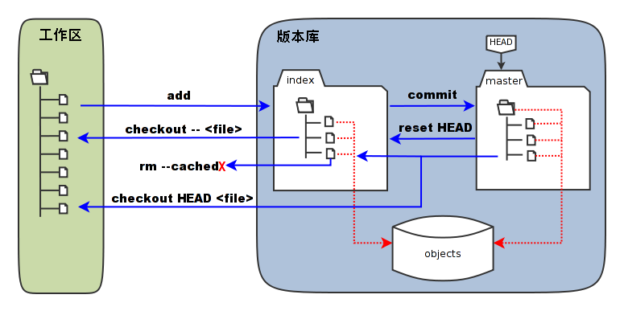

## 引言

我们知道一个git项目由三个部分组成，工作区(work tree)，暂存区(index area)以及版本库。我们所关注的是文件在这三个部分之间的差别,以及版本库中不同历史提交之间的差别。在实际的工作中对于比较文件差异我们一般会使用编辑器自带的功能或者是安装插件，但是了解一些命令对与学习git也是很有帮助的。



### 常用的四个比较命令：
1. [`git diff [--options] [--] [<path>…​]`](#cmd_1)
2. [`git diff [--options] --cached [<commit>] [--] [<path>…​]`](#cmd_2)
3. [`git diff [--options] <commit> [--] [<path>…​]`](#cmd_3)
4. [`git diff [--options] <commit> <commit> [--] [<path>…​]`](#cmd_4)

### 1: `git diff [--options] [--] [<path>…​]` <span id="cmd_1">工作区文件和暂存区文件差异:</span>

该命令是用于比较工作区(work tree)中的文件与暂存区(index/staged area)域快照之间的差异， 也就是修改之后还没有暂存起来的变化内容。

``` bash 查看当前修改状态
E:\warriorsworld.github.io>git status
On branch sourceCode
Changes to be committed:
  (use "git reset HEAD <file>..." to unstage)

        modified:   source/_posts/hello-world.md

Changes not staged for commit:
  (use "git add <file>..." to update what will be committed)
  (use "git checkout -- <file>..." to discard changes in working directory)

        modified:   source/_posts/hello-world.md
```

例如在上面的操作中，先对hello-word文件内第6行增加一个modified英文单词，然后通过<code>git add .</code>将改动增加到暂存区。然后在第7行增加modify单词。然后输入<code>git diff</code>会看到只有最后一次修改没有加入到暂存区的差异。

``` bash
E:\warriorsworld.github.io>git diff
diff --git a/source/_posts/hello-world.md b/source/_posts/hello-world.md
index 4c0ee2d..41e5f3d 100644
--- a/source/_posts/hello-world.md
+++ b/source/_posts/hello-world.md
@@ -5,7 +5,7 @@ Welcome to [Hexo](https://hexo.io/)! This is your very first post. Check [docume

 ## Quick Start modified

-### Create a new post
+### Create a new post modify
```
### 2: `git diff [--options] --cached [<commit>] [--] [<path>…​]` <span id="cmd_2">暂存区与版本库之间的差异:</span>

该命令是用于比较暂存区(index/staged area)域快照与版本库之间的差异， 也就是通过<code>git add</code>命令添加进暂存区与版本库之间的差异，如果不加之前提交版本号就是比较与最后一次提交比较的差异，当然还可以添加历史提交版本号以及具体路径或是文件。

``` bash
E:\warriorsworld.github.io>git diff --cached
diff --git a/source/_posts/hello-world.md b/source/_posts/hello-world.md
index c090297..4c0ee2d 100644
--- a/source/_posts/hello-world.md
+++ b/source/_posts/hello-world.md
@@ -3,7 +3,7 @@ title: Hello World
 ---
 Welcome to [Hexo](https://hexo.io/)! This is your very first post. Check [documentation](https://hexo.io/docs/) for more info. If you get any problems when using Hexo, you can find the answer in [troubleshooting](https://hexo.io/docs/troubleshooting.html) or you can ask me on [GitHub](https://github.com/hexojs/hexo/issues).

-## Quick Start
+## Quick Start modified
```
我们接着上次的修改执行<code>git diff --cached</code>命令，应该只会比较出之前在第6行添加进暂存区的modified的修改内容。

### 3: `git diff [--options] <commit> [--] [<path>…​]` <span id="cmd_3">工作区(work tree)本库之间的差异:</span>

这里需要注意的是<code>git diff</code>不添加参数是比较工作区与暂存之间的差异，如果添加具体版本号参数则是比较工作区与版本库中具体版本之间的差异。那么大家想想如果现在我执行该命令与最后一次提交的比较会是什么结果呢？没错，当然就应该包括暂存起来的修改和暂存之后再次修改的总和了。不信我们试试~

``` bash
E:\warriorsworld.github.io>git diff b823cb6c4103363ac880c67e9183897e24f366b2
diff --git a/source/_posts/hello-world.md b/source/_posts/hello-world.md
index c090297..41e5f3d 100644
--- a/source/_posts/hello-world.md
+++ b/source/_posts/hello-world.md
@@ -3,9 +3,9 @@ title: Hello World
 ---
 Welcome to [Hexo](https://hexo.io/)! This is your very first post. Check [documentation](https://hexo.io/docs/) for more info. If you get any problems when using Hexo, you can find the answer in [troubleshooting](https://hexo.io/docs/troubleshooting.html) or you can ask me on [GitHub](https://github.com/hexojs/hexo/issues).

-## Quick Start
+## Quick Start modified

-### Create a new post
+### Create a new post modify
```

### 4: `git diff [--options] <commit> <commit> [--] [<path>…​]` <span id="cmd_4">本库中不同版本之间的差异:</span>

版本库会记录着我们每一次的提交历史，当我我们要对比历史两个版本的所有修改或是某个文件或是路径的修改，该命令可以帮到我们。现在接着我们将之前的修改提交到版本库中，然后再在第六行后面添加一个单词'test'，然后执行该命令看看会是什么结果。

首先我们执行<code>git log --pretty=oneline</code>来查看历史的提交记录，将会按提交时间的进行排列，最后提交的在最上面。

``` bash
E:\warriorsworld.github.io>git log --pretty=oneline
2465e830e114302198c3ef2542367aa3640e1ab9 (HEAD -> sourceCode) '再添加一个历史版本'
67ab9471ee50064fa173725c4a73f05e2f6480bd '添加一个历史版本'
b823cb6c4103363ac880c67e9183897e24f366b2 (origin/sourceCode, master) 测试
566b901caccf227acb32578ad21a5c2f506da9ea hello world
```
然后我们通过执行git diff 67ab94 2465e命令进行最后两个提交版本的比较。注意，参数的顺序是第一个参数是倒数第二个提交，第二个版本号是最后一次提交，这样我们才能看到增加了<code>test</code>的结果，如果两个版本号互换位置的话就会得到相反的结果。

``` bash
E:\warriorsworld.github.io>git diff 67ab94 2465e
diff --git a/source/_posts/hello-world.md b/source/_posts/hello-world.md
index 41e5f3d..02c119b 100644
--- a/source/_posts/hello-world.md
+++ b/source/_posts/hello-world.md
@@ -3,7 +3,7 @@ title: Hello World
 ---
 Welcome to [Hexo](https://hexo.io/)! This is your very first post. Check [documentation](https://hexo.io/docs/) for more info. If you get any problems when using Hexo, you can find the answer in [troubleshooting](https://hexo.io/docs/troubleshooting.html) or you can ask me on [GitHub](https://github.com/hexojs/hexo/issues).

-## Quick Start modified
+## Quick Start modified test

 ### Create a new post modify
```

