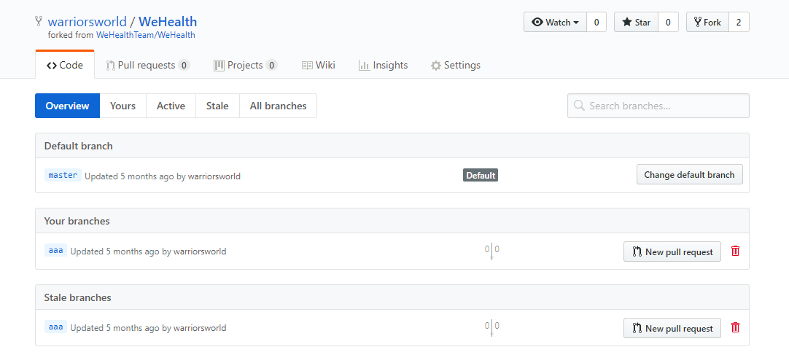

## 引言

我们在协同迭代开发的过程中经常会碰到这样一种场景，就是我们在开发过程中的不同阶段要给测试提供一个版本的代码，这个版本可能需要维护一段事件，主干也会同步开发新的功能。项目周期很长的话就会产生很多分支代，而且有的分支代码随着产品的迭代合并早已不再维护或许已在远端删除，但是这些分支快照仍然在你的本地仓库中存在。如果在产生一个新的需要维护的分支，当从远端拉下代码后，在一大堆分支列表里找到要维护的分支名称有时都有点费事。所以我们来说一说如何保持我们本地仓库分支的整洁。

### 这个场景下使用到的命令只有三个
1. [`git branch [-a|-r]`](#cmd_1)
2. [`git remote show origin`](#cmd_2)
3. [`git remote prune origin`](#cmd_3)

### 使用<code>git branch [-a|-r]</code> <span id="cmd_1">命令来查看所有或者远程分支

<code> git branch -a </code>命令可以查看所有的分支列表，包括本地和远端的；<code> git branch -r </code>命令可以查看所有远程的分支列表，不带参数只会返回本地的分支。这里为了演示，我在本地创建了一个分支<code> aaa </code>,然后<code> push </code>到远端。

``` bash
E:\WeHealth>git branch -a
* aaa
  master
  remotes/origin/HEAD -> origin/master
  remotes/origin/aaa
  remotes/origin/master
```

这时我们打开github该项目的页面，可以看到该分支已经同步到远端了。这时候我们为了演示该场景的需要，在页面上删除该分支。



然后再执行<code> git branch -a </code>命令发现该分支还存在。因为你紧紧只是在远程删除了该分支，本地仍然存储了这个分支的快照，我们必须通过手动来删除这个分支。

``` bash
E:\WeHealth>git branch -a
* aaa
  master
  remotes/origin/HEAD -> origin/master
  remotes/origin/aaa
  remotes/origin/master
```

### 使用<code> git remote show origin </code> <span id="cmd_2">可以查看remote地址，远程分支，还有本地分支与之相对应关系等信息

``` bash
E:\WeHealth>git remote show origin
* remote origin
  Fetch URL: https://github.com/warriorsworld/WeHealth.git
  Push  URL: https://github.com/warriorsworld/WeHealth.git
  HEAD branch: master
  Remote branches:
    master                  tracked
    refs/remotes/origin/aaa stale (use 'git remote prune' to remove)
  Local branch configured for 'git pull':
    master merges with remote master
  Local ref configured for 'git push':
    master pushes to master (up to date)
```
这是我们可以看到，刚才在远端删除的aaa分支后面出现了一行提示(use <code> git remote prune </code> to remove)。

### 使用<code>git remote prune</code> <span id="cmd_3">删除那些远程仓库中已经不存在的分支

``` bash
E:\WeHealth>git remote prune origin
Pruning origin
URL: https://github.com/warriorsworld/WeHealth.git
 * [pruned] origin/aaa
```

<code> git remote prune </code> 命令必须指定要删除对应远端仓库的名称，这里是origin。这时再去执行<code> git branch -a <code>，分支列表中的<code> aaa </code>分支肯定是不存在了。

``` bash
E:\WeHealth>git branch -a
* aaa
  master
  remotes/origin/HEAD -> origin/master
  remotes/origin/master
```