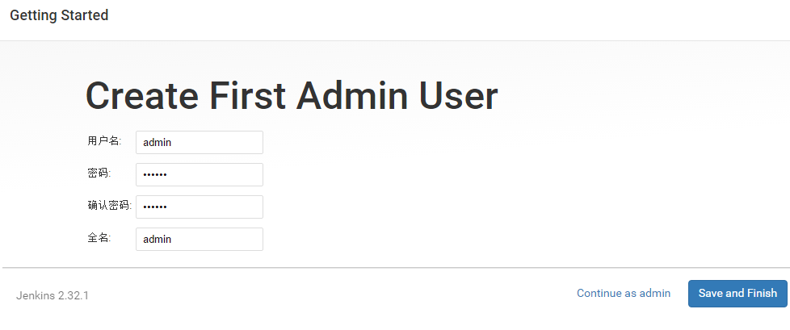

## 引言

首先简单科普一下[持续集成](https://baike.baidu.com/item/%E6%8C%81%E7%BB%AD%E9%9B%86%E6%88%90/6250744)(Continuous Integration, 简称CI)的概念。

<blockquote style="padding: 16px;background: #EEF0F4;border-left: 8px solid #DDDFE4;">持续集成是一种软件开发实践，即团队开发成员经常集成他们的工作，通常每个成员每天至少集成一次，也就意味着每天可能会发生多次集成。每次集成都通过自动化的构建(包括编译，发布，自动化测试)来验证，从而尽快地发现集成错误。 --- Martin Fowler</blockquote> 

从应用的角度来说，也就是在我们的项目开发中，任何人对代码库的修改，都会触发CI服务器对项目的自动构建，自动运行测试，甚至到最后的测试环境部署。这样做的好处是，随时的发现问题，随时修复，可以让产品快速的迭代，同时还能保证代码质量。常用的持续集成软件有:

- Travis CI：是一个在线托管的CI服务，和github强关联。使用它来持续集成，不需要自己搭建服务器，对开源项目免费，对github的私有项目需有偿使用。

- Jenkins CI：需要自己搭服务器，功能与Travis类似，免费的CI提供商。

除此之外还有 [CodeShip](https://codeship.com/)，[QuickBuild](https://www.pmease.com/) 等常见的构建工具，大家有兴趣可以学习了解一下。

### 本文实现目标

本文将从 jenkins 的安装，配置，插件安装以及最终实现在 github 提交代码后，经过 jenkins 的自动化构建将最终打包好的代码部署在远程的测试服务器的整个流程为目标来讲解前端代码自动化部署的过程。

1. [jenkins的安装](#cmd_1)
2. [相关插件的安装](#cmd_2)
3. [jenkins的相关配置](#cmd_3)
4. [jenkins与github的webhook的挂载](#cmd_4)
5. [实例项目的集成部署实例](#cmd_5)

<!--more-->

### 一: jenkins的安装

jenkins的安装比简单，我了解的有两种安装方式:

- war包[(下载地址)](http://mirrors.jenkins-ci.org/war-stable/)的安装方式: 
1. 启动方式一: 进入到jenkins.war存放的目录，输入如下命令：<code> java -jar jenkins.war </code>，浏览器输入<code> localhost:8080 </code>即可访问；

2. 启动方式二: 用tomcat打开，将jenkins.war文件放入tomcat下的webapps目录下；重启tomcat，浏览器输入<code> localhost:8080/jenkins </code>即可访问。

使用 war 注意的坑是，不同版本的 jenkins 对 jdk 的版本有一定的要求，我开始下载的最新版本的<code> jenkins 2.121.1 </code> 在<code> java7 </code>下就不支持，大家使用的时候注意下

- msi安装包安装: 傻瓜式的下一步点到头就好了，浏览器输入<code> localhost:8080 </code>即可访问。

初始的管理员密码，jenkins自动生成的，根据上面红色的路径找到密码，拷到下面的输入框中即可。

安装插件，可以默认的安装，也可以自己选择，（jenkins配置好后也可以安装插件）这里我们选择默认的。

安装完成以后，我们开始创建用户

后就可以进入到jenkins的主页了

### 二: 相关插件的安装

在本次示例场景下主要用到的两个插件分别是
- Git plugin: 用于jenkins在每一次构建项目时从github拉取代码和一系列更新操作

- GitHub Plugin: 用于jenkins与github之间的通讯

默认在我们安装jenkins使用了安装jenkins推荐的插件安装选项，Git plugin插件就会被安装。如果没有安装，我们可以从 [系统管理] > [管理插件] > [可选插件] 中安装我们需要的相关插件。

插件安装好后，我们可以在 [已安装]中找到安装过的插件，并对插件进行管理

### 三: jenkins的相关配置

我们为了达到github的行为通知jenkins做出相应的响应，并将打包的代码发布到远程开发环境中，就需要分别对github和远端服务器在jenkins上做相应的配置。

#### 1. 配置jenkins访问github的权限

github plugin 插件安装好后，我们通过 [系统管理] > [系统设置] 找到 Github，对 Github 进行配置。首先填写 API URL，如果我们用的免费版本，填写 https://api.github.com 就好，在认证部分点击 add > jenkins , 在 kind 的中选择 Secret text

其中 ID 和 Description 可以随意填写， Secret 需要到 github 账户 Settings > Developer settings > Personal access tokens 去生成

在生成 token 的页面填写token描述信息，并勾选相应的权限，如果拿不准，可以全部选择。jenkins 中提示至少需要 admin:repo_hook，repo，以及 repo:status 这三个权限

token 生成后会返回上一个页面显示，这时必须将生成的 token 保存下来(该token只会在第一次生成显示，刷新页面将会消失，如果没有记住就得重新生成)，填入刚才 Secret 的输入框中。

#### 2. 配置远程服务器地址

进入[系统管理] > [系统设置] > Publish over SSH 进行配置，分别填写服务器名称, 远端地址，用户名，以及远端的路径。该远端路径也就是之后代码部署的基础路径。

点击 [Test Configuration] 如果测试通过会有 success 的提示，就说名我们远端服务器和 jenkins 的连接成功了。

### 四: jenkins与github的webhook的挂载

在上一步github的配置中，点击删除按钮的下面的 [高级] 按钮，勾选 Specify another hook url for GitHub configuration 复选框，下面会出现在github的webhook中需要配置的jenkins的地址。这个地址的作用是当github上有相应的相应，比如push或者pull reques的时候，github以这个地址给jenkins发一个post请求，通知jenkins开始构建。

然后在到github相应的仓库在 settings > Hooks 下，将该地址填入相应的位置

然后选择触发的事件类型，这个我们选择 Pushes 和 Pull request

### 五: 实例项目的集成部署实例

至此，我们对于 jenkins 和 github 的相关配置就完成了，现在我们就来做一个小例子来实践以把，感受一下 jenkins 的便捷和威力

1. 创建一个项目: 在 jenkins 首页点击 [新建] 填入项目名称，选择 [构建一个自由风格的软件项目]并点击 ok

2. 对项目进项配置，首先配置项目的基础信息，包括项目名称，描述，github的仓库地址

其次，配置项目的源码管理，选择 git ,配置仓库地址，构建分支等

第三，配置构建触发器，选择 GitHub hook trigger for GITScm polling

第四，配置构建环境，选择 Use secret text(s) or file(s)，并在 Bindings 中选择之前添加的 Credential

第五步，添加构建步骤，这里选择 Execute shell 即执行一段脚本，脚本可以在 command 输入框中填写，写可以单独写一个 sh 文件，单独执行。

最后一步，选择[构建后操作]配置我们代码要部署的远程服务器，输入服务路径，源码路径，部署代码的路径，已经部署后执行的脚本，这里我们是将压缩后的代码放置具体目录后，强制覆盖解压。

最后...
最后...
见证奇迹的时候到了，我们修改一下代码，对仓库进行push操作，就会在jenkins里出现一条构建记录，如果成功的话，构建记录左边会有一个蓝色的小球标识，失败的话会是红色。当让点击该记录可以进去看到更为详细的构建log

